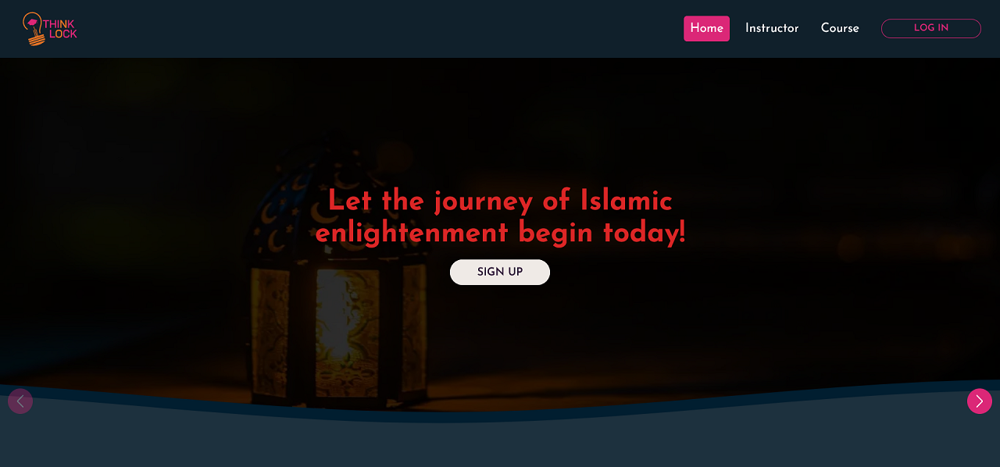

### ThinkLock (A LMS Website)

#### Tech:

React, React Router, JWT, Axios, TanStack Query, Node, Express, MongoDB, Firebase.

#### Feature:
- Displayed popular courses so that students can easily purchase most courses.
- Implemented authentication and authorization for different roles.
- Students can purchase courses by paying Stripe.

###### [Server Code](https://github.com/khalidccnu/thinklock-server-side) | [Live](https://thinklock.netlify.app)
